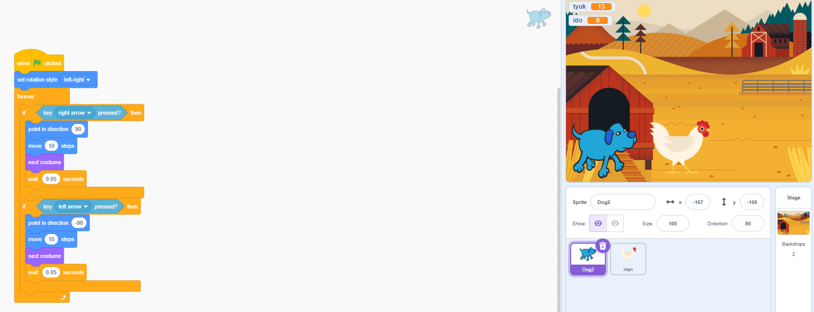

# Falusi Hajsza - Interaktív Scratch Játék

Ez egy dinamikus és szórakoztató ügyességi játék, amelyet Scratch környezetben fejlesztettem ki. A projekt célja egy interaktív élmény létrehozása, ahol a játékosnak gyors reflexekre van szüksége.

## 🎮 Játékmenet
A játékos egy hűséges kutyát irányít, akinek a feladata, hogy a falusi udvaron minél több rakoncátlan tyúkot "tereljen össze" (kapjon el) a megadott időn belül. 

### Irányítás:
* **Nyíl billentyűk:** A kutya mozgatása jobbra és balra.
* **Zöld zászló:** A játék indítása és az adatok alaphelyzetbe állítása.

## 🚀 Főbb Funkciók és Mechanizmusok

### 1. Interaktív Pontgyűjtés
Minden alkalommal, amikor a kutya sikeresen elkapja a tyúkot, a játék egy hangeffektussal jelzi a sikert, a `tyúk` változó értéke pedig automatikusan 1-gyel növekszik. Az elkapott tyúk ezután azonnal egy új, véletlenszerű helyre ugrik a pályán, így a hajsza sosem áll meg.

### 2. Dinamikus Visszaszámláló
A játék nem végtelen: a képernyő sarkában egy élő visszaszámláló látható. A játékosnak pontosan **30 másodperce** van a pontok begyűjtésére. 

### 3. "Okos" Ellenfél (Véletlenszerű mozgás)
A tyúk mozgása nem kiszámítható. Egy összetett algoritmus gondoskodik arról, hogy a szárnyas folyamatosan cikázzon:
* Menekülés közben véletlenszerűen változtatja az irányát (balra vagy jobbra fordul).
* Ha eléri a pálya szélét, automatikusan visszapattan, így mindig játékban marad.

### 4. Vizuális és Hangélmény
* **Animációk:** Mind a kutya, mind a tyúk váltogatja a jelmezeit mozgás közben, ami élethű futást és szárnycsapkodást eredményez.

## 🛠️ Technikai megvalósítás
A projekt során az alábbi Scratch blokkokat és logikai elemeket használtam:
* **Ciklusok:** `mindig` (forever) és `ismételd addig, amíg` (repeat until) a folyamatos működésért.
* **Feltételek:** `ha ... akkor` (if-then) az ütközések és gombnyomások érzékeléséhez.
* **Változók:** Globális változók a pontszám és a hátralévő idő tárolására.
* **Üzenetszórás:** A modulok közötti kommunikáció a játék leállításakor.

## Képernyőmentés

